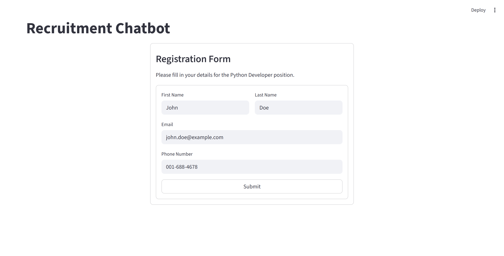
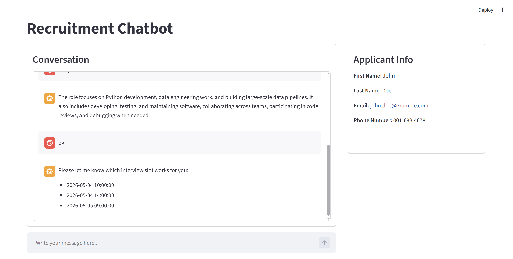
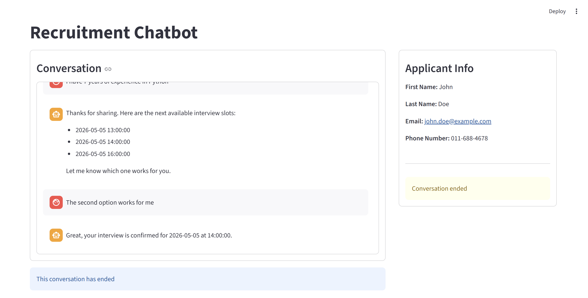

<!-- PROJECT LOGO -->
<p align="center">
  
</p>

<h1 align="center">Recruitment Chatbot – Multi-Agent Orchestration</h1>

<p align="center">
  A Streamlit proof-of-concept for a multi-agent recruiting chatbot<br>
  <a href="#demo">View Demo</a>
  ·
  <a href="#demo">Report Bug</a>
  ·
  <a href="#demo">Request Feature</a>
</p>

---
<br></br>

## Table of Contents

- [About The Project](#about-the-project)
- [Features](#features)
- [Architecture & Design](#architecture--design)
- [Getting Started](#getting-started)
- [Usage](#usage)
- [Screenshots](#screenshots)
- [Project Structure](#project-structure)
- [License](#license)
- [Contact](#contact)
- [Acknowledgments](#acknowledgments)

---
<br></br>


## About The Project

> This project implements a **multi-agent recruitment chatbot** designed to interact with job candidates for a Python Developer position.

The chatbot simulates an SMS-based conversation (implemented via Streamlit for this PoC) and is responsible for guiding candidates through the recruitment process. Its main objectives are:

- Collect and verify candidate information 
- Answer questions about the role 
- Progress the conversation toward scheduling an interview 
- Politely end the conversation when appropriate 

### System Overview

The system is built using a **modular multi-agent design**, where a central orchestrator (Main Agent) collaborates with specialized advisor agents:

- **Main Agent** – Manages the conversation and decides the next action 
- **Info Advisor** – Answers candidate questions using RAG over a job description PDF 
- **Scheduling Advisor** – Suggests and validates interview time slots using a SQL database 
- **Exit Advisor** – Determines when the conversation should end (fine-tuned model) 

At each turn, the system selects one of three actions:

- `CONTINUE` – keep the conversation going 
- `SCHEDULE` – move toward booking an interview 
- `END` – conclude the interaction 

### Evaluation

The system is evaluated using a labeled dataset of real conversations, where each turn is annotated with the correct action (`continue`, `schedule`, `end`). 

Performance is measured using:
- Accuracy 
- Confusion Matrix 

This project demonstrates how multi-agent orchestration, retrieval-augmented generation (RAG), and tool integration can be combined to build a realistic, goal-oriented conversational system.
<br>

<div style="background: #272822; color: #f8f8f2; padding: 10px; border-radius: 8px;">
  <b> Technologies:</b> Python, Pandas, NumPy, Matplotlib, OpenAI API, LangChain, SQL Server, Streamlit, Chroma
</div>

---
<br></br>


## Features

- Multi-agent conversation orchestration (Main Agent + Advisors)
- Intelligent routing between:
  - Continue conversation
  - Schedule interview
  - End conversation
- Retrieval-Augmented Generation (RAG) for answering job-related questions
- Interview scheduling via SQL Server (function calling)
- Natural language date handling (e.g., "next Monday")
- Fine-tuned Exit Advisor for conversation termination decisions
- Streamlit-based interactive chat interface
- Conversation state management across turns
- Evaluation framework using labeled conversations (accuracy & confusion matrix)
- Cloud deployment  

---
<br></br>

## Architecture & Design

### Architecture Overview

The system is built as a multi-agent recruiting chatbot. A central Main Agent orchestrates the conversation and coordinates specialized advisor agents.

The system operates around three high-level outcomes (continue, schedule, end).

The architecture combines LLM-based reasoning with deterministic Python control logic. This hybrid approach ensures both flexibility in language understanding and reliability in system behavior.The agents decide what should happen, while the Python orchestration layer controls routing, state updates, tool execution, and final response construction.

### Conversation Flow

At each user turn, the system follows a structured decision flow:

Main Agent  
↓  
Exit Advisor (first)  
↓  
Routing Decision (LLM)  
↓  
Primary Advisor (Info or Schedule)  
↓  
Optional Secondary Advisor (handoff)  
↓  
Final Response + State Update

The Main Agent orchestrates the process. It first checks whether the conversation should end using the Exit Advisor. If not, it determines the appropriate route (continue or schedule) and invokes the relevant advisor.

Advisors may optionally request a handoff to another advisor within the same turn. The Main Agent then combines the outputs and updates the conversation state accordingly.

### Agent Roles

The system is composed of a Main Agent and three specialized advisor agents.

#### Main Agent
- Orchestrates the conversation flow
- Calls the Exit Advisor first
- Decides routing (`continue` or `schedule`)
- Invokes advisor agents
- Combines responses and updates the conversation state

#### Exit Advisor
- Determines whether the conversation should end (`END` or `CONTINUE`)
- Uses a fine-tuned model for classification
- Generates a closing message when ending

#### Scheduling Advisor
- Handles interview scheduling interactions
- Suggests available time slots
- Validates user-proposed dates and times
- Books interview slots
- Uses database tools to access available interview slots

#### Info Advisor
- Answers candidate questions about the role
- Uses Retrieval-Augmented Generation (RAG) over the job description (OpenAI embeddings, in-memory Chroma DB)
- Assesses candidate relevance
- Can trigger a handoff to scheduling when appropriate

### Agent Contracts

Each agent returns a structured output that is used by the Main Agent for orchestration.

All agents follow a common structure:

```json
{
  "decision": "...",
  "assistant_message": "...",
  "handoff_to": "...",        // optional
  "handoff_context": "...",   // optional
  "state_update": {...}
}
```

### Decision Values per Agent

- Exit Advisor: END | CONTINUE

- Scheduling Advisor: SCHEDULE | NONE

- Info Advisor: INFO | NONE

- Main Agent (final): continue | schedule | end

### Notes

`assistant_message` is the natural language response shown to the user

`handoff_to` allows an agent to request another advisor within the same turn

`handoff_context` provides additional context for the receiving agent

`state_update` contains partial updates to the shared conversation_state

The full definition of the conversation state and update logic is available in:

👉 `conversation_state_schema.md`

### Conversation State

The system maintains a shared `conversation_state` object that is used to coordinate the conversation between agents.

The state tracks:
- the current conversation status (`active`, `scheduling`, `scheduled`, `ended`)
- the last action taken by the system
- scheduling progress (offered slots, selected slot, booking status)
- the last decisions made by each advisor

The state is updated incrementally by agents using structured `state_update` outputs.  
The Main Agent merges these updates after each turn.

The conversation state is used for control flow and decision-making, while the full chat history is used for natural language understanding.

👉 See `conversation_state_schema.md` for the full specification.

---

##  Getting Started

### Prerequisites

- Python >= 3.12
- pip

## Live Demo

You can access the deployed application to streamlit community cloud here:

👉 https://genaifinalproject-mqr3xjd9xcr6ywglzoyz2n.streamlit.app/

Note: Tech DB is deployed to Azure SQL, so connection on the first time can take longer

### Running the application on a Windows machine

Follow these steps to run the application on a Windows machine, using a local SQL Server database created with SSMS.

#### 1. Clone the repository and create virtual environment
```bash
git clone https://github.com/bermanalon/GenAI_final_project.git
cd GenAI_final_project


python -m venv .venv

.venv\Scripts\activate 

pip install -r requirements.txt

```
#### 2. Configure environment variables
Create a .env file based on the provided template:
```bash
copy .env.example .env
```
Edit the .env file and set the following values:
```env
OPENAI_API_KEY=your_api_key_here

APP_ENV=local

DB_DRIVER=ODBC Driver 17 for SQL Server
DB_SERVER=your_sql_server
DB_DATABASE=Tech
```
#### 3. Create Tech Data base
Run the following script in SSMS to create and populate the database:
```sql
db_Tech.sql
```
The sample database may contain historical demo dates. If needed, update the dates to the current project year before testing scheduling flows.
For example - you can use the following script (adding 2 years):
```sql
UPDATE dbo.Schedule
SET [date] = DATEADD(YEAR, 2, [date]);
```
Note: it will cause scheduling slots to fall also on Saturdays and Sundays.
#### 4. Run the application
Run the application
```bash
streamlit run streamlit_app/streamlit_main.py
```


---
<br></br>


## Usage

After starting the Streamlit application, the user first fills in a short registration form with basic applicant details.

The chatbot then opens a conversation interface where the candidate can:

- Describe their professional experience
- Ask questions about the Python Developer role
- Request to schedule an interview
- Confirm or reject suggested interview slots

The Main Agent manages each user turn and routes the conversation to the appropriate advisor:

- `Info Advisor` for job-related questions
- `Scheduling Advisor` for interview scheduling
- `Exit Advisor` for detecting when the conversation should end

The conversation ends when an interview is confirmed or when the candidate clearly asks to stop or is no longer interested.

---
<br></br>

## Screenshots

### Registration



### Conversation



### Confirmation


---
<br></br>

## Project Structure

```text
GenAI_final_project/
├── .gitignore                     # Specifies files/folders ignored version coontrol
├── README.md                      # Project documentation
├── requirements.txt               # Python dependencies
├── .Venv/                         # Virtual environment (ignored by Git)
├── .env.example                   # Template for environment variables
├── .env                           # Local environment variables (ignored by Git)
│
├── sms_conversations.json         # Labeled dataset of conversations
├── db_Tech.sql                    # SQL script to create interview slots database
├── Python Developer Job Description.pdf  # Source document for RAG (Info Advisor)
│
├── app/                           # Core application logic
│   ├── __init__.py                # Package initializer
│   ├── main.py                    # Main backend entry point (called by Streamlit)
│   │                              # Initializes system and processes user messages
│   │
│   └── modules/                   # Application modules
│       ├── __init__.py            
│       │
│       ├── orchestration/         # Multi-agent orchestration layer
│       │   ├── __init__.py        
│       │   ├── main_agent.py      # Main orchestrator (decides: continue / schedule / end)
│       │   ├── exit_agent.py      # Exit Advisor (END vs CONTINUE decision, fine-tuned)
│       │   ├── info_agent.py      # Info Advisor (answers questions using RAG)
│       │   └── schedule_agent.py  # Scheduling Advisor (handles interview scheduling logic employing tools to access the database)
│       │
│       ├── scheduling/            # Scheduling tools and database interaction
│       │   ├── __init__.py        
│       │   ├── schedule_db.py     # SQL Server access layer (queries, validation, booking)
│       │   └── schedule_tools.py  # Function-calling tools exposed to the LLM
│       │
│       └── info/                  # Retrieval-Augmented Generation (RAG)
│           ├── __init__.py
│           ├── retriever.py       # Chroma-based document retrieval from PDF embeddings
│           └── embedding_build.py # Optional demo script for testing PDF embedding and retrieval
│
├── streamlit_app/                 # User interface (Streamlit)
│   ├── __init__.py
│   └── streamlit_main.py          # Main Streamlit app (UI, chat loop, state management)
│
├── tests/                         # Evaluation, testing, and fine-tuning artifacts
│   ├── __init__.py
│   ├── tests_main.py              # Automated evaluation runner (accuracy, confusion matrix)
│   ├── test_evals.ipynb           # Notebook for evaluation and analysis of the routing performance
│   │
│   ├── routing_eval_dataset.jsonl # Dataset for evaluating routing decisions
│   │                              # (continue / schedule / end classification)
│   │
│   ├── exit_advisor_training.jsonl           # Training dataset for Exit Advisor fine-tuning
│   ├── exit_advisor_training_augmented.jsonl # Augmented training dataset (improved coverage)
│   ├── exit_advisor_test.jsonl               # Test dataset for evaluating fine-tuned model
│   │
│   └── exit_finetune.ipynb       # Notebook for preparing data and running fine-tuning for the exit advisor model
│
├── assets/                        # Images used in README (screenshots)
│   ├── registration.png          # Registration form screenshot
│   ├── conversation.png          # Conversation example screenshot
│   └── confirmation.png          # Booking confirmation screenshot
```

---
<br></br>

## License

This project is licensed under the MIT License. See the `LICENSE` file for details.

---
<br></br>


## Contact

Alon Berman   - [@berman.alon@gmail.com]

Project Link: [https://github.com/bermanalon/GenAI_final_project]

---
<br></br>


## Acknowledgments

## Acknowledgments

This project builds upon several tools and technologies that enabled rapid development and experimentation:

- **Python** – core programming language used for the system 
- **OpenAI API** – for LLM-based reasoning, embeddings, and fine-tuning capabilities  
- **LangChain** – for lightweight agent orchestration and tool integration  
- **Chroma** – for in-memory vector storage and retrieval in the RAG pipeline  
- **Streamlit** – for building the interactive user interface  
- **SQL Server** – for managing interview scheduling data  

---
